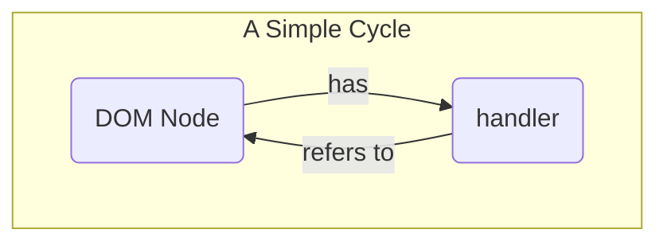
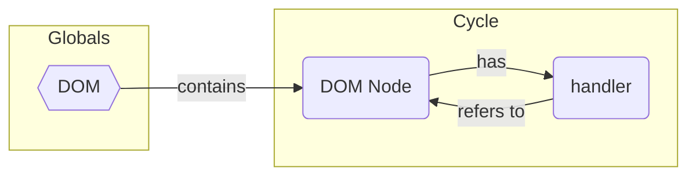
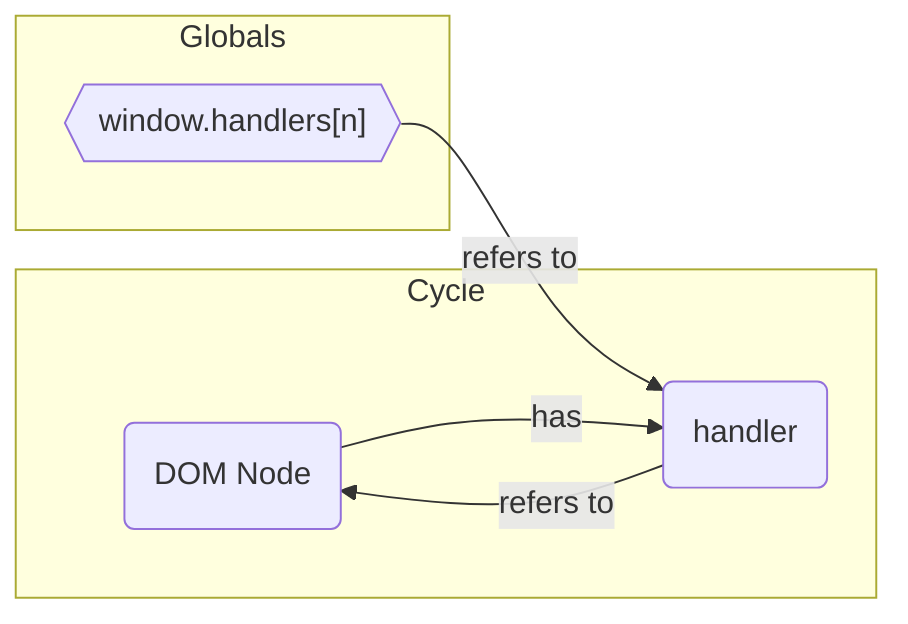
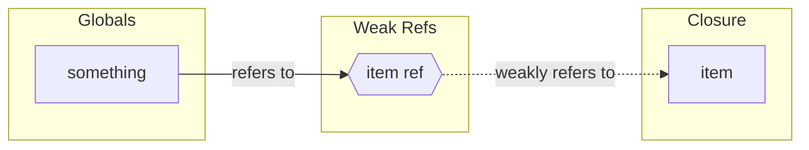
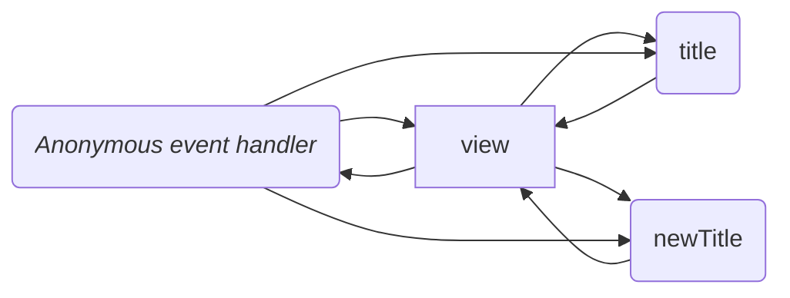

# Managing garbage collection in `wirejs-dom`

I'm writing this to help myself visually map out and track what bits of the framework could end up holding *other* bits, either created directly by the framework or by userland code, in memory &mdash; or worse &mdash; triggering repeated updates to nodes that are neither in the DOM *nor ever will be again*.

The particular case where this is a concern is in managing event callbacks. Two types of callbacks come to mind. The most concerning of these are the callbacks we create for notifying components (or listeners thereof) when those components are added to or removed from the DOM.

## Firstly, Here's What We Know

Whenever objects become "unreachable" from a root scope (e.g., `global` or `window`), they can be cleaned up. *That's basically it.* This is done using a "mark and sweep" alogrithm. Unlike reference counting approaches, this organically removes cycles by starting from the global scope, finding all reachable objects, marking them as "reachable", and recursing. when this is done, any objects that haven't been reached are garbage collected. (See [MDN](https://developer.mozilla.org/en-US/docs/Web/JavaScript/Memory_management#mark-and-sweep_algorithm).)

So, in one of the simplest base cases, we might have a node with a handler that refers to the node itself. This forms a cycle. Reference counting garbage collectors don't organically know how to bust these cycles.



However, the mark and sweep algorithm used by all modern JavaScript engines knows to destroy these objects when all *other* references to both `DOM Node` and `handler` are eliminated. Put another way, if nothing from the global scope points to these objects (directly or indirectly), they're "unreachble".

#### The `document`.

The `document` can be considered a root scope. Hence, nodes in the `document` are reachable and are not eligible for garbage collection.



#### The `window`.

The `window` object is a root scope. Properties of `window`, including global variables, are therefore reachable. And anything those property point to or have closures around are considered reachable.



#### Event loops.

The event loop is a root scope. It can "reach" thing that are registered in the [event loop queue](https://developer.mozilla.org/en-US/docs/Web/JavaScript/Event_loop#queue). When a DOM event is fired, or we set a timeout, or create an interval, the registered callback goes into the event loop queue (roughly speaking), making it accessible to the event loop, and thus making it reachable by a root scope.

### Weak References

We can also use "weak" collections and references to refer to items *from a root scope* without retaining the objects in memory.

```js
function getSomething() {
    const item = {...};
    return new WeakRef(item);
}

window.something = getSomething();
```

Now, although the global `something` property refers to `item` from the `getSomething()` closure, it's a weakly held reference. Consumers of the global `something` will first need to check whether the reference still contains `item` before using it &mdash; and in our trivial example, we would expect `item` to disappear very quickly because *nothing else* refers to it.



When the garbage collector performs its sweep, it traverses from `something` to `item ref` and *stops*. It does not traverse down to `item`. It is considered "unreachable" from the global scope and is liable for garbage collection.

## Now, `wirejs-dom`'s Important Cases

### Case 1 - Event Callbacks

For example:

```ts
const view = html`<div>
    <h3>${text('title', 'unknown title')}</h3>
    <form onsubmit=${event => {
        event.preventDefault();
        view.title = view.newTitle;
        view.newTitle = '';
    }}>
        <p>Set a new title:</p>
        <input type='text' value=${attribute('newTitle')} />
        <input type='submit' value='set' />
    </form>
</div>`;
```

In this case, we have a reachability graph that looks something like this:



In other words, *pretty much everything refers to everything else.* Strictly speaking, the `view` nestles the `title` and `newTitle` properties under its `data` property; but they're essentially reachable via `view`. And each property receives the `view` as context and may or may not hold onto that context indefinitely. At the very least, each property holds onto a *portion* of the `view` nodes and/or their attributes.

In general, the `node` is *expected* to be the "local root" object, holding the whole structure in memory so long as it's in the `document`; but nothing really prohibits a customer from grabbing a reference to `view.data`, thus keeping the whole structure in memory long after `view` leaves the `document`.

### DOM `onadd` and `onremove` events

The final API design is pending, but we could imagine it looks something like this:

```ts
const view = html`<div>
    some html
</div>`.on({
    add() {},
    remove() {},
});
```

### CSS Signals

### Other Remote Concerns

The only other area that comes to mind are "components containing other components". However, this *shouldn't* be much of a concern. We don't do anything special here. But, prior to launching for real, it might be worth mapping these out as well. E.g., when a `text()` node or a `list()` node are created, does anything get dropped into global scope that keeps these things alive? Are common patterns customers might employ that would be harmful?

